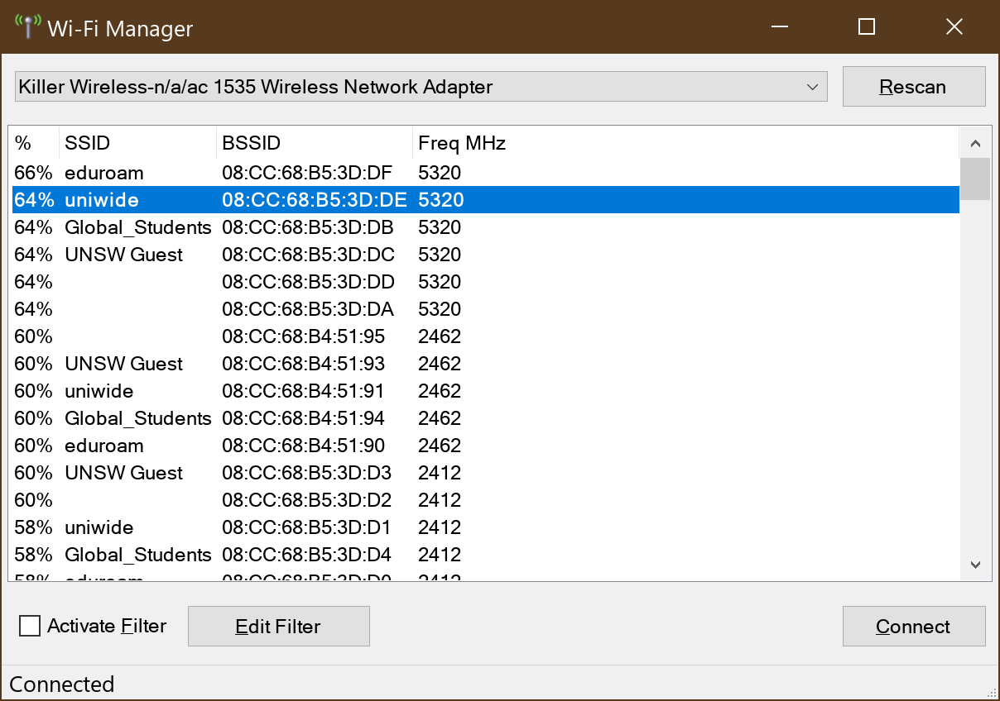

# Windows Wi-Fi Manager
By default, Windows will automatically select which BSSID to connect to based on primarily signal strength. Some Wi-Fi drivers allow the user to configure this behavior so that a certain characteristic of the network is more preferred (for example, some wireless drivers allows user to select "Prefer 5 GHz only" in their options). However, the built-in features in Windows does not allow the user to specify BSSID manually.

However, the native Wi-Fi API, first introduced in Windows XP Service Pack 2, allowed application programs to specify BSSID manually. The aforementioned feature is only available from Windows Vista or newer though. This small utility leverages that API to allow the user to manually specify BSSID to connect into.

## System Requirements

The main interface is a pure .NET 4.0 WinForms application, however the backend is written in C++/CLI for .NET 4.0. This version is compiled on x64 platform only, but should be compilable to x86 and ARM64 as well.

Requires at least Windows 10. However, the API can be trivially changed to support all Windows version down to Windows Vista.

## Usage

This application consists of the main executable (`BssidSwitcher.exe`) and the library DLL file for communicating with native Wi-Fi API (`NativeWifi.dll`). Make sure both resides in the same directory and run `BssidSwitcher.exe`. Also make sure that the Visual C++ 2019 redistributable is already installed.

This application can only connect to Wi-Fi networks that has a profile already configured for that SSID. The easiest way to create a profile for an SSID is by connecting to it first using the default Windows Wi-Fi network selector. Connecting to a local machine profile (for example, those profiles that was created from lock screen) may requires this program to be run as an administrator.

## Known Limitations

- SSIDs covered by more than one profile is not supported.
- Hidden SSIDs are not supported.